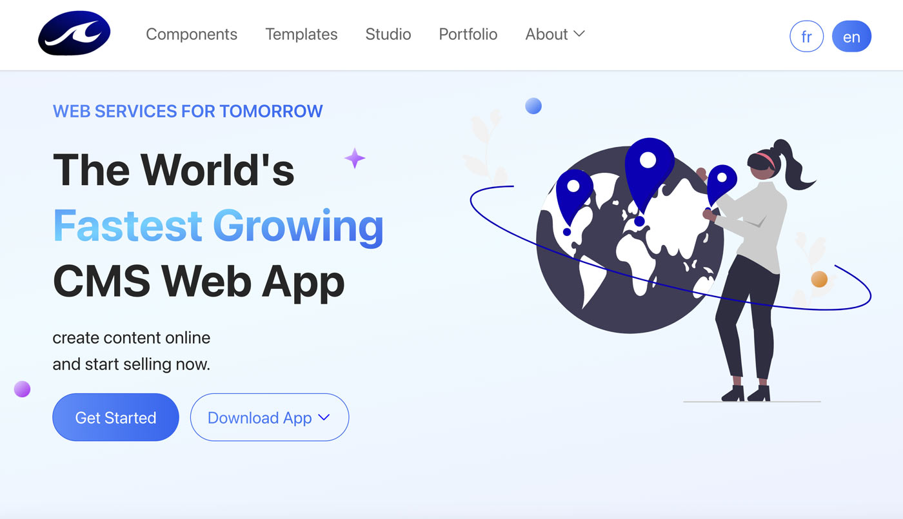

# Nuxt 3 tailwind fixed menu responsive width dropdown Minimal Starter

       

Nuxt3 / TailwindCss template with top fixed menu and dropdown, AOS animations, based on nuxt2 [NEFA](https://www.tailwindawesome.com/resources/nefa)

## Online Demo 

### layout 


- [Home page with full height hero section and 80% opaque transparent menu](https://nuxt-wave-tailwind-git-main-breizhwaves-projects.vercel.app/)
- [About Page with variable height section and content padding](https://nuxt-wave-tailwind-git-main-breizhwaves-projects.vercel.app/about)

### effects and animations
- [touch slider with infinite loop by swiper](https://nuxt-wave-tailwind-git-main-breizhwaves-projects.vercel.app/effects/swiper)
- [entry animation by animejs](https://nuxt-wave-tailwind-git-main-breizhwaves-projects.vercel.app/effects/anime)
- [scroll based horizontal text translation by motion](https://nuxt-wave-tailwind-git-main-breizhwaves-projects.vercel.app/effects/motion)




## Features and components 

- WaveIcon.vue custom component for minimal set of icons
- ContentListItem.vue list element with tick icon
- BaseNavBar.vue for dorpdown top fixed menu 

## Setup

clone this repository


```bash
# clone this repository or click 'use this template' button
$ git clone https://github.com/breizhwave/nuxt-wave-tailwind-2024.git

# install dependencies
$ pnpm install

# serve with hot reload at localhost:3000
$ pnpm dev


# build for production and launch server
$ pnpm build
$ pnpm start

# generate static project
$ pnpm generate
```

 note : if you get the following  tricky error while generating,
  Error: Could not load /opt/homebrew/lib/node_modules/@nuxt/devtools/node_modules/unstorage/drivers/fs-lite.mjs
  please try  [`pnpm add unstorage]` (https://github.com/nuxt/nuxt/issues/22828#issuecomment-1769180213)


## TODO / current issues

- better animations 
- <i>Hydration class mismatch on</i> AOS elements in dev mode

## credit
~~~~
- more technical details on https://webmasterbulletin.net 
- images from  https://undraw.co/ , https://unsplash.com/ and https://wave.bzh
